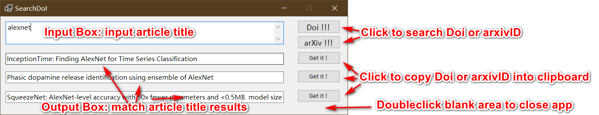

# SearchDoi
An winform application to search article's Doi or arxivID according title quickly.

# Usage
As show in the image, this application is easy to use.
 

But I recommend to use this application with [Autohotkey](https://github.com/Lexikos/AutoHotkey_L). The example below is a script of Autohotkey. When you press F3, this script copies selected content into clipboard and opens SearchDoi with the input box filled by clipboard text content.

```ahk
F3::
    Clipboard := ""
    SendInput, ^c
    ClipWait, 10
    if ErrorLevel
        Return
        
    run,%Yourpath%\SearchDoi.exe "%clipboard%"
return
```

# Release
This application is based on Netcore 3.1 and an release of application is located in `bin\Release\netcoreapp3.1`. Happy use!